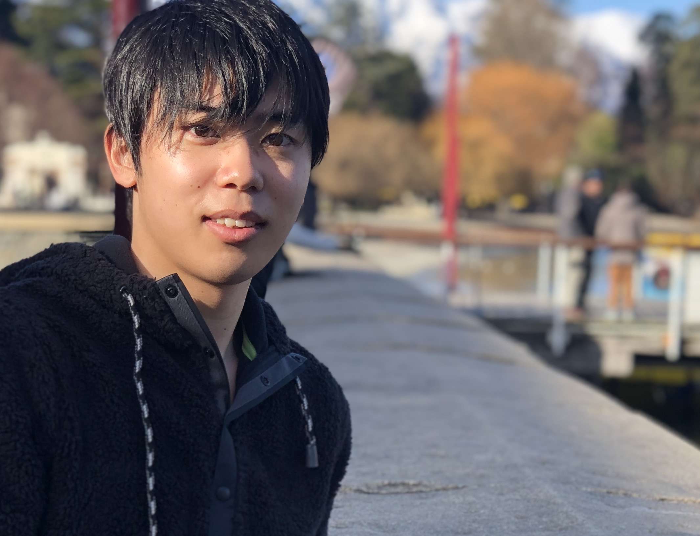

  

<H2 align="center">
  Hi! I'm Ryosuke Okamae.
</H2>

早稲田大学 情報理工学科

Full Stack Web developer and ML engineer

  
  
  
  

  
  

[English](/README.md) | 日本語

## 自己紹介

初めまして！早稲田大学情報理工学科の岡前亮介です。プログラミング，話すこと，旅行，漫才を見ること，将棋を指すことが大好きです。これまで，経営企画に関するインターンシップをフルタイムで2ヶ月，機械学習やデータ分析に関するインターンシップをパートタイムで合計2年間行いました。業務委託で仕事の依頼を受け付けています。お問い合わせはFacebook(Messanger)またはInstagramのDM等からお気軽にどうぞ！

## スキル

### プログラミング言語

Python | Java | JavaScript | TypeScript | C

### フレームワーク / ライブラリ

#### Web

Servlet/JSP | Spring | Django | Flask | React | Vue.js

#### 機械学習 / データ分析

PyTorch | TensorFlow / Keras | Apatch SPARK(and algorithms for parallel and distributed computing) | CUDA

### RDB/NoSQL

MySQL | PostgreSQL

### クラウド

以下のAWS技術を利用した経験があります。  
VPC | S3 | Cloud Front | API Gateway | EC2 | ECS | Beanstalk | Route53 | IAM | RDS (MySQL | PostgreSQL).  
また，GCPやAzureも利用した経験があり，少ない学習コストで使用可能です。

### SaaS/PaaS

GitHub | GitHub Actions | BitBucket | CircleCI | GitLab

### 言語

- 日本語 (ネイティブ)
- 英語 (中級)

### その他

Docker | nginx | Apache | Tomcat | Gulp | Webpack | SASS | Latex | Linux | Algorithms

## 発揮できる価値

- アジャイル開発
- フロントエンド/バックエンド開発
- コンテナ化(Docker化)
- 単体テストや統合テストの導入
- 機械学習/深層学習のリサーチや実装

### 興味がある/勉強中の分野

- AR
- プロジェクトマネージメント

## 学歴

### 早稲田大学

Computer Science and Engineering
東京, 日本
2018.3 - 2022.9
情報理工学について幅広く学んでいます。

### University of Canterbury

Computer Engineering (交換留学生)
カンタベリー, ニュージーランド
2020.2 - 2022.7
[Software Engineering Group Project](https://www.canterbury.ac.nz/courseinfo/GetCourseDetails.aspx?course=SENG302&occurrence=20W(C)&year=2020)(Group project: https://csse-s302g3.canterbury.ac.nz/prod/), [Web Computing Architectures](https://www.canterbury.ac.nz/courseinfo/GetCourseDetails.aspx?course=SENG365&occurrence=20S1(C)&year=2020), [Big Data Computing](https://www.canterbury.ac.nz/courseinfo/GetCourseDetails.aspx?course=DATA301&occurrence=20S1(C)&year=2020)などを勉強しました。

## Work Experience

### [エヌエヌ生命保険 株式会社](https://www.nnlife.co.jp)

【期間】2019.6 - 2020.1 パートタイム(アルバイト)

【担当業務】全国の中小企業に関するデータ分析を行いました。様々な統計モデルや機械学習モデルを使い，ビッグデータから有用な情報を取り出しました。

### [株式会社 Pluszero](https://plus-zero.co.jp/)

【期間】2019.4 - 2020.1 パートタイム(アルバイト)

【担当業務】BERTなどの機械学習モデルを用いて、校閲エンジンの開発をしていました。
また、小規模の論文調査においてPMを担当しました。

### [株式会社 Aidemy](https://aidemy.co.jp/)

【期間】2017.7 - 2017.8 パートタイム(アルバイト)

【担当業務】チューター業務、コンテンツ作成、業務効率化

### [辻本郷税理士法人](https://www.ht-tax.or.jp/) 経営企画室

【期間】2017.7 - 2017.8 フルタイム(アルバイト)

【担当業務】新人研修企画、業務効率化、新規事業企画、業界リサーチ

## Award

- 軟式野球部 2016全国大会準優勝 / 2016国民体育大会準優勝
- [高校生起業家コンテストNES](https://www.facebook.com/next.entrepreneur.summit/) 準優勝
- [全国高校生未来会議](https://www.facebook.com/revisionjapan/) 最優秀賞

## Qualification

- 日商簿記検定 2級  
  高校在学中に取得しました。
- [東京大学松尾研究室・Deep Learning for NLP 講座](https://deeplearning.jp/deep-learning-for-nlp/) 修了  
  VANやSeqGANなどの最新論文を理解し，一から実装しました。
